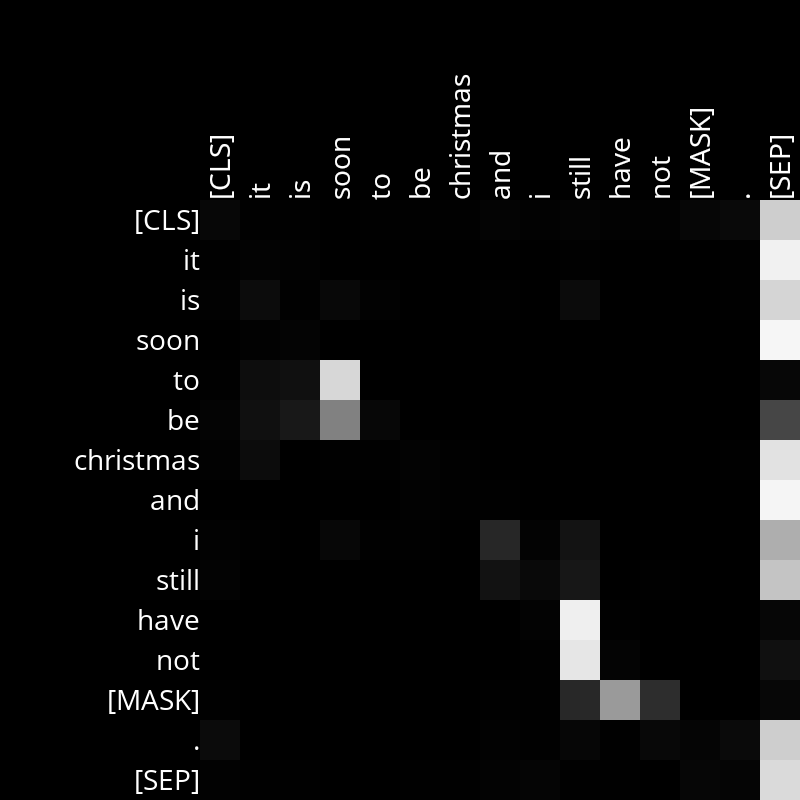

# Analysis

## Layer 6, Head 7
Noticed a relationship between words that attend to temporal adverbs. In the first sentence is very obvious that words that relate to 'soon' or 'still' have the strongest attention values.
For the second sentence, this is also true but it is more noisy. We can still see strong relationship between 'the' and 'comes' to 'when', which is again a temporal adverb.

Example Sentences:
- it is soon to be Christmas and I still have not [MASK] .
- when the winter comes around, I tend to feel [MASK] . 

<!-- 

 -->

## Layer TODO, Head TODO

Example Sentences:
- TODO
- TODO

